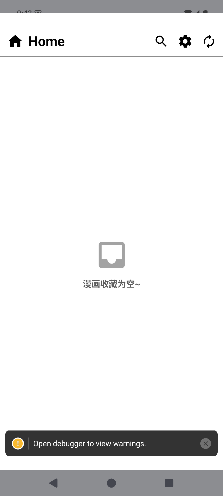
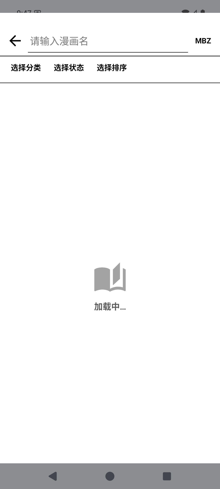
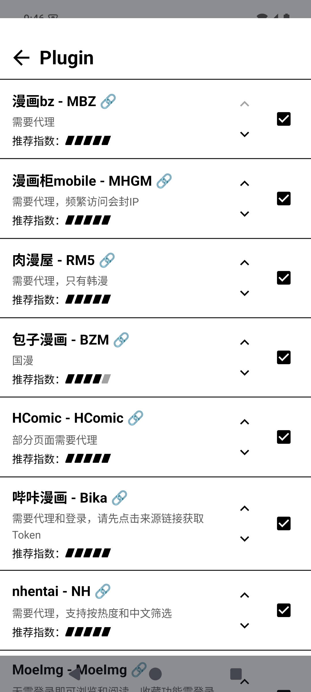
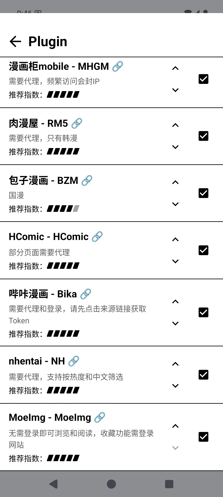
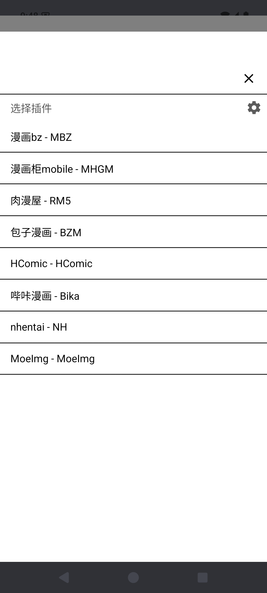
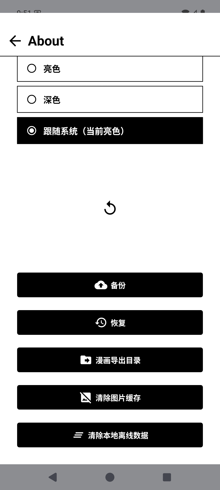
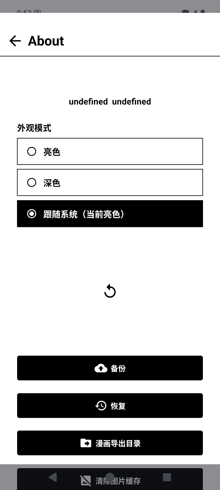

# MangaReader（电子墨水屏版）


> **本仓库是 [youniaogu/MangaReader](https://github.com/youniaogu/MangaReader) 的安卓电子墨水屏（E-Ink）改版 fork。**
> 原作者仓库同时维护兼容 Android + iOS 的版本；本 fork 在原作基础上针对电子纸设备做了全面改造（黑白静态 UI、移除所有动画、实体键翻页等），并替换了部分已失效的漫画源。原作的开源工作是一切的基础，在此表示衷心感谢。

一个基于 React Native 的漫画阅读 APP，**仅支持 Android**，面向电子纸（E-Ink）设备：全局黑白高对比静态 UI，移除所有装饰动画与程序化翻页动画；数据全部离线存储在本地，支持备份和恢复。

最低支持 **Android 7（API 24）**；当前版本 **0.7.10**（与 `package.json`、`android/app/build.gradle` 同步）。

## 界面预览

所有截图均截自 **Android 15 模拟器**运行的 debug 包（`com.youniaogu.mangareader`），1080×2400：

### 书架与发现

| 书架（空状态） | 发现（加载中） |
| --- | --- |
|  |  |

### 插件管理（全部 8 个当前可用源）

| 插件列表（顶部） | 插件列表（底部 / MoeImg） |
| --- | --- |
|  |  |

> 每个插件卡片展示：名称、shortName（MBZ / MHGM / BZM / RM5 / HCOMIC / BIKA / NH / MOEIMG）、代理 / 登录 / CF 校验等说明、`推荐指数`（菱形评分）、启用开关、源站链接。**所有 8 个插件均已启用。**

### 插件选择器

| 弹窗（全部 8 个） |
| --- |
|  |

### 关于与设置

| 关于（顶部：主题切换） | 关于（底部：备份 / 恢复 / 缓存） | 按压反色反馈 |
| --- | --- | --- |
|  |  |  |

> **关于** 页同时提供：主题切换（亮色 / 深色 / 跟随系统三态）、最新版本检查、备份 / 恢复、漫画导出目录、清除图片缓存、清除本地离线数据。底部截图展示了墨水屏按压反色反馈：选中"跟随系统（当前亮色）"项按下时瞬时黑白反色，松手恢复 — 没有淡入淡出 / 透明度过渡。

## 墨水屏适配

- **黑白高对比静态 UI**：纯黑白配色 + 少量中灰，无阴影、渐变和透明遮罩，适合电子纸显示
- **零动画**：导航 `animation: 'none'`；阅读器所有 `scrollToIndex / scrollToOffset` 固定 `animated: false`；弹窗、抽屉、翻页全部瞬时切换，无惯性滚动与淡入淡出
- **三态主题**：亮色 / 深色 / 跟随系统；深色为纯黑底、纯白文字与边框；当前主题会镜像到 Android 冷启动 Splash，避免启动闪白 / 闪黑；**漫画图片、WebView 内容不反色、不加滤镜**
- **实体键翻页**（核心特性）：阅读页原生拦截 **音量 +/-**、**PageUp / PageDown**、**方向键 ← / →**，松手触发一次翻页，无长按重复；可在阅读页工具栏开关；**已在掌阅（iReader）电子墨水屏阅读器上测试通过**
- **按压反馈**：可交互元素按下瞬时黑白反色、松开恢复（无渐变与透明度过渡）
- **图片内存优化**：图片缓存上限 512MB、淡入 0；Canvas 解码封顶 8MP；解密 / base64 图仅保留 `file://` URI 与尺寸；仅预取下一页

## 功能

- 插件式设计，**8 个漫画源** [插件](#插件)
- 收藏、搜索、批量更新、下载、导出
- 翻页 / 条漫 / 双页模式、保存图片
- 定时翻页、实体键翻页（电子墨水设备）
- 主题切换：亮色 / 深色 / 跟随系统
- 数据全本地离线化，支持备份和恢复

## 实体键翻页使用说明

- 在阅读页顶部工具栏切换「实体键翻页」开关
- 仅在阅读页聚焦时激活原生拦截，退出阅读页自动交还按键给系统（避免与系统音量条冲突）
- 与缩放 / 滑动翻页手势互斥：`scale > 1` 时仍由缩放 Pan 接管
- **已在掌阅（iReader）电子墨水屏阅读器上测试通过**：按键响应正常、无长按重复翻页、不影响其他系统手势

## 插件

> 以下 8 个插件对应 `src/plugins/index.ts` 的 `PluginMap` 注册顺序。

| 名称 | ID | 地址 | 备注 |
| --- | --- | --- | --- |
| 漫画bz | `MBZ` | https://mangabz.com/ | 需要代理 |
| 漫画柜 mobile | `MHGM` | https://m.manhuagui.com/ | 需要代理，频繁访问会封 IP |
| 肉漫屋 | `RM5` | https://rouman5.com/ | 需要代理，只有韩漫 |
| 包子漫画 | `BZM` | https://cn.baozimhcn.com/ | 海外 IP 走 Cloudflare，需 WebView 校验通过 |
| HComic | `HCOMIC` | https://h-comic.com/ | 部分页面需要代理 |
| 哔咔漫画 | `BIKA` | https://manhuabika.com/plogin/ | 需要代理和登录，Token 存 Android Keystore（不进入 Redux / 备份） |
| nhentai | `NH` | https://nhentai.net/ | 需要代理 |
| MoeImg | `MOEIMG` | https://moeimg.fan/ | 浏览和阅读无需登录 |

部分插件通过 `src/views/Webview.tsx` 使用系统 WebView 的 Cookie 维护登录态与 Cloudflare 校验；哔咔漫画的 Token 由 WebView 获取后**仅**写入 Android Keystore，不会进入 Redux 状态或备份文件。

## 技术栈

- **React Native 0.81.6** + React 19.1.4 + TypeScript 5.9.3
- **Android**：minSdk **24**（覆盖 Android 9 / API 28）、compileSdk / targetSdk **36**、Kotlin 2.1.20、NDK 27.1、Gradle 8.14.3、AGP 8.11.0；Hermes 开启；仅构建 ARMv7 / ARM64
- **状态管理**：Redux Toolkit + redux-saga（`src/redux/`），dev 环境启用 redux-logger
- **UI**：NativeBase 3.4（已通过 patch-package 补丁移除 SSRProvider）+ react-navigation（native-stack）+ react-native-reanimated 3.19（仅保留缩放 / 平移操控）+ @shopify/flash-list 1.8
- **抓取**：cheerio 解析 HTML + 自定义 fetch 封装（`src/utils/fetch.ts`）
- **存储**：react-native-mmkv（`src/utils/storage.ts` 封装，可切换回 AsyncStorage）+ react-native-file-access + @georstat/react-native-image-cache
- **包管理**：强制使用 `yarn`（`preinstall` 钩子 `only-allow yarn`）

## 项目结构

```
android/app/src/main/java/com/mangareader/eink/
└── EInkKeyModule.java        # 实体翻页键原生桥接（音量 / PageUp-Down / 方向键）
src/
├── App.tsx                   # 导航 + Provider 组装（animation: 'none'）
├── plugins/                  # 插件系统（核心）：base.ts + 8 个源 + index.ts
├── redux/                    # slice / saga / store（rootSlice + initialState）
├── schema/                   # typescript-json-schema 生成的 JSON Schema
├── views/                    # Home / Discovery / Search / Detail / Chapter（阅读器）
│                             # Plugin / Webview / About 共 8 个页面
├── components/               # Reader / Controller / ComicImage / Bookshelf / Overlay 等
├── hooks/                    # usePageKeys / useInterval / usePrevNext 等
├── utils/                    # enum / common / fetch / storage / reader / einkKey / theme/
└── types/                    # global.d.ts / store.d.ts / plugins.d.ts / router.d.ts
__tests__/                    # App 冒烟 + reader 翻页决策 + migrateSetting 迁移
patches/                      # patch-package 补丁
```

## 开发与构建

```bash
yarn install               # 安装依赖（postinstall 自动执行 patch-package）
yarn start                 # 启动 Metro
yarn android               # 运行 Android debug 包
yarn build-android         # 打包 Android release（cd android && ./gradlew assembleRelease）
yarn build-android-sideload# 打包个人侧载 APK（assembleSideload：继承 release 优化 + debug 签名）
yarn lint                  # eslint 校验 **/*.{ts,tsx}
yarn typecheck             # TypeScript 静态类型检查
yarn test                  # jest
yarn jsonschema            # 重新生成 src/schema/*.json
yarn clean                 # react-native-clean-project 深度清理
```

> Windows 环境下，`./gradlew` 是 Unix 写法，在 cmd / PowerShell 中请改用 `gradlew.bat`。

## 下载与安装

- **Android（电子墨水设备推荐使用 sideload 侧载包）**：[下载 APK](https://github.com/xulingran/MangaReader/releases)
- **iOS**：本 fork 不提供；如需 iOS 版本请使用原作仓库 [youniaogu/MangaReader](https://github.com/youniaogu/MangaReader)

## 关于原作与致谢

- 原项目地址：https://github.com/youniaogu/MangaReader
- 原作兼容 Android + iOS，本 fork 仅在原作基础上做**安卓电子墨水屏**适配
- 插件系统、状态管理、抓取与存储、UI 框架等基础能力均继承自原作
- 感谢原作者 [youniaogu](https://github.com/youniaogu) 的开源工作，这是本项目能够存在的前提

## 关于本 fork

- 维护：[xulingran/MangaReader](https://github.com/xulingran/MangaReader)
- 与原作同步：跟随原作进行 bug 修复与新源接入的移植
- 墨水屏相关特性（黑白 UI、零动画、实体键翻页、按压反馈等）为本 fork 独有
- 遇到问题或想贡献代码，欢迎在本仓库提交 Issues / PR

## 许可

[MIT](./LICENSE) — 与原作保持一致。
